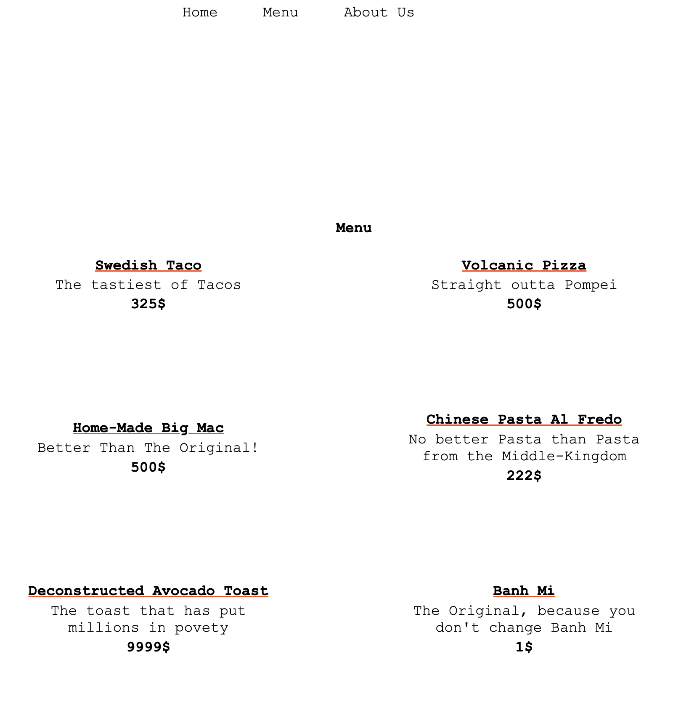

# odin-TicTacToe

#### Access the page [here](https://benjamin-albarzendji.github.io/odin-restaurant-page/)

### Description
#### My first project upcoming the complexity considerably. This project uses webpack, NPM modules, and E6 modules where everything is generated in javaScript with close to no HTML elements in the index.html file. 

####Image from Unsplash:
https://unsplash.com/photos/u2Lp8tXIcjw